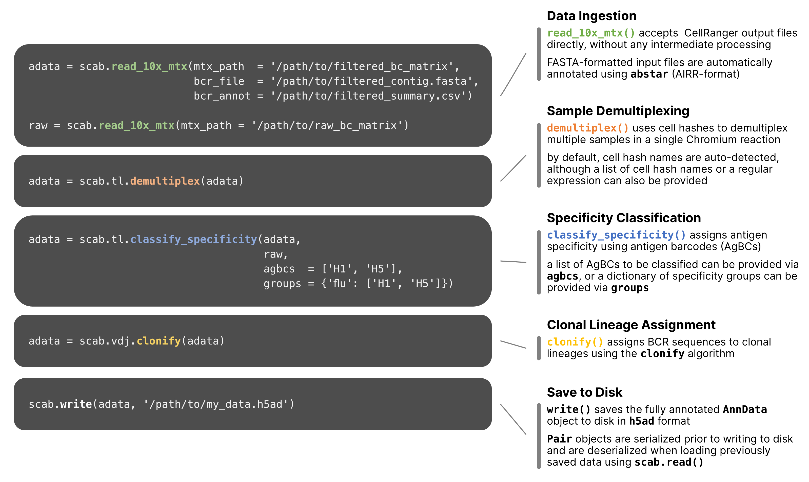

scab: single cell analysis of B cells
===================================================================
 
scab provides a computational framework for integrating, analyzing and 
visualizing single B cell multi-omics data. The scab package consists of 
two primary components: 

:ref:`scabranger <scabranger>`
   a command line interface (CLI) wrapper around CellRanger that allows 
   customizable batch processing of multiple samples with data 
   spread across one or more sequencing runs
:ref:`scab API <api>`
   a Python API for processing, analyzing, and visualizing single
   cell datasets, with a focus on B cell receptor (BCR) repertoire analysis

|

We have tried to design a simple, straightforward API that should 
feel quite familiar to users of scanpy_. scab allows sophisticated 
analyses with just a few lines of code:  

.. image:: images/scab_console-workflow.jpg
  :width: 750
  :alt: example workflow in scab
  :align: center
  :class: only-light
  

  
|   
  
scab is a standards-based toolkit built on the ``AnnData`` objects used 
by scanpy_. We integrate several tools specifically designed to facilitate 
analysis of adaptive immune cells and receptor repertoires.     

|  

.. toctree::
   :maxdepth: 1
   :hidden:
   :caption: getting started

   overview
   installation

|

.. toctree::
   :maxdepth: 1
   :hidden:
   :caption: usage

   scabranger
   api examples <examples>

.. toctree::
   :hidden:
   :caption: api

   api
   

|

.. toctree::
   :maxdepth: 1
   :hidden:
   :caption: about

   references
   license
   news

|

.. toctree::
   :maxdepth: 1
   :caption: related projects

   abstar <https://github.com/briney/abstar>
   abutils <https://github.com/briney/abutils>
   clonify <https://github.com/briney/clonify-python>

.. _scanpy: https://github.com/scverse/scanpy
